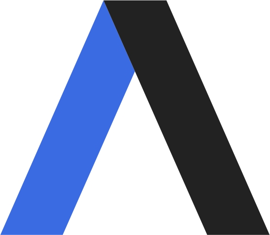

<h1 align="center">
  
</h1>

<h5 align="center">
  <code><a href="https://www.linkedin.com/in/sinaedu11/" title="LinkedIn Profile"> LinkedIn</a></code>
  <code><a href="https://t.me/Sinaace11" title="Telegram Profile"> Telegram</a></code>
  <code><a href="https://www.instagram.com/sinamohammadi___04/" title="Instagram Profile"> Instagram</a></code>
</h5>

  👨‍💻 ReactJS Developer | 🚀 Frontend Enthusiast | 🎨 UI/UX Passionate  
  
 
Passionate about building interactive and scalable web applications using ReactJS.   
With 3+ years of experience, I specialize in creating responsive and user-friendly web solutions.  
 
🔹 Tech Stack: ReactJS, JavaScript, Tailwind CSS, Redux, Axios, Formik, GitHub   
🔹 Experienced in developing admin and student panels, handling APIs, and UI/UX design.   
🔹 Open to collaborations and new opportunities!   
  📫 Contact: sina.edu11@gmail.com
   

<h2 align="center">⚡ Stats ⚡</h2>
 

  

    
    
  

           
  

    
  

   

  

